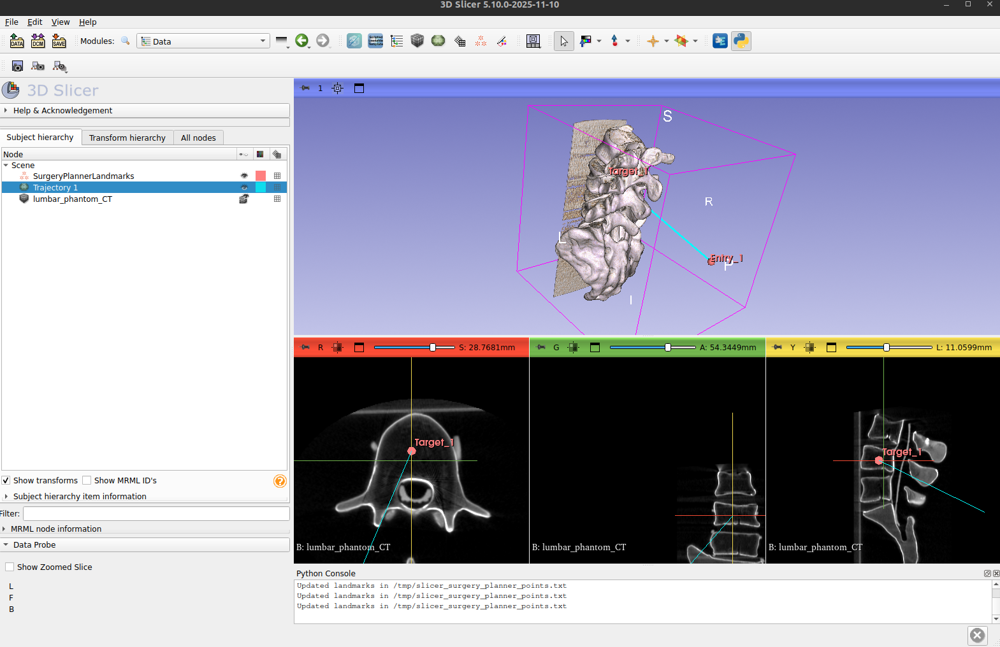
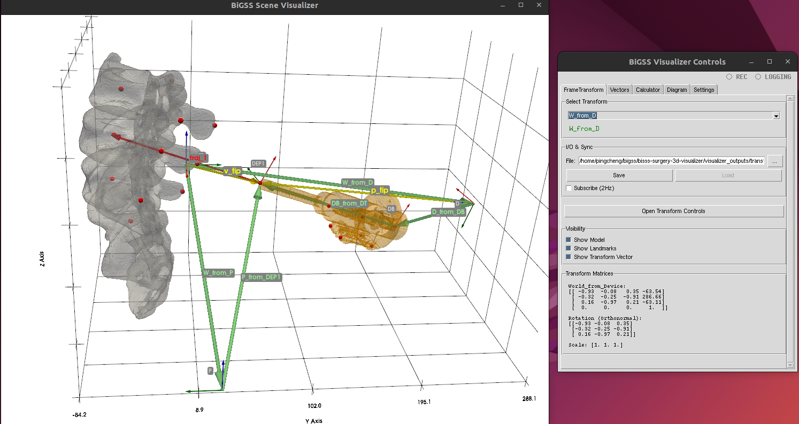
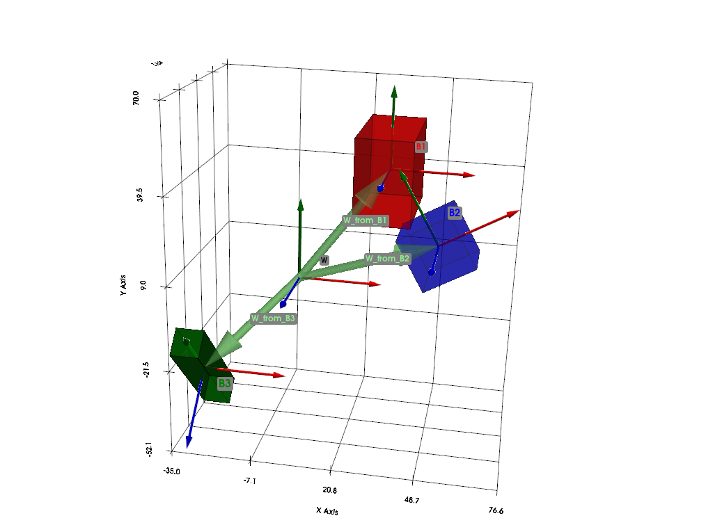

# bigss-slicer-planner-visualizer

Tools for visualizing SE(3) kinematic chains, NIfTI models, and verifying transforms using slicer annotations

## Installation

1. Create the conda environment:
   ```bash
   conda create -n bigss-vis python=3.10
   conda activate bigss-vis
   ```

2. Install dependencies:
   ```bash
   pip install -r requirements.txt
   ```

3. Download Example Data:
   Download `example_data.zip` from the [Releases](../../releases) page and extract it to the project root.
   ```bash
   unzip example_data.zip
   ```
   This will create an `example/` directory containing necessary models and data.


This package relies on a refactored version of the `KilleenGeo` package developed by Benjamin Killeen. The original repository can be found [here](https://github.com/benjamindkilleen/killeengeo).

## Key Scripts

- **`visualizer_main.py`**: Interactive PyVista-based visualizer. Supports hierarchical transforms, NIfTI models, and basic shapes.

## Configuration Files

- **`configs/config.yaml`**: Main configuration for real models (Phantom, Device).

## Usage

### 1. Run Visualizer (Test Scenario)
Visualize a mock kinematic chain (World -> Block_01 -> Block_02) with interactive controls.
```bash
python3 visualizer_main.py configs/config_test.yaml
```

### 2. Run Visualizer (Real Models)
Visualize the Phantom and Device setup.
```bash
python3 visualizer_main.py configs/config.yaml
```

### Workflow Overview

Our workflow integrates trajectory planning from 3D Slicer with real-time visualization. Users can create detailed trajectory plans within 3D Slicer (with the `bigss-surgery-planner` repository), as depicted in the planning interface below:



These annotations are dynamically exported, allowing for immediate visualization of the planned `FrameTransforms` in our interactive visualizer. The visualizer also displays the rigid transformation `SE(3)` matrix for the robot/tool




A simple example of the visualizer that demonstrates FrameTransforms and Kinematic Chain using block models is shown below (this uses configs/config_test.yaml as visualizer input):



### Contact 
Ping-Cheng Ku (pku1@jh.edu)
